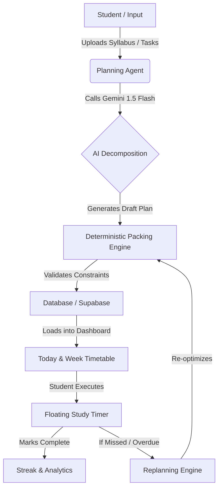

# 🧠 HELIX — Adaptive AI Student Planner

> **An intelligent student planning and study platform that adapts to your real academic workload, availability, deadlines, priorities, and learning progress.**

[](https://www.typescriptlang.org/)
[](https://react.dev/)
[](https://vitejs.dev/)
[](https://tailwindcss.com/)
[](https://supabase.com/)
[](https://firebase.google.com/)
[](https://ai.google.dev/)

---

## 📌 Table of Contents

1. [Why HELIX Exists](#-why-helix-exists)
2. [Problem Statement](#-problem-statement)
3. [The Problem With Existing Student Planners](#-the-problem-with-existing-student-planners)
4. [HELIX Solution](#-helix-solution)
5. [Core Philosophy](#-core-philosophy)
6. [Key Features](#-key-features)
7. [Complete Feature Breakdown](#-complete-feature-breakdown)
8. [How HELIX Works](#-how-helix-works)
9. [Adaptive Planning Engine](#-adaptive-planning-engine)
10. [AI Layer](#-ai-layer)
11. [Study Intelligence](#-study-intelligence)
12. [Replanning System](#-replanning-system)
13. [Notifications](#-notifications)
14. [User Data Model](#-user-data-model)
15. [Architecture](#-architecture)
16. [Technology Stack](#-technology-stack)
17. [Application Pages](#-application-pages)
18. [Authentication](#-authentication)
19. [Database](#-database)
20. [Security](#-security)
21. [Environment Variables](#-environment-variables)
22. [Local Development](#-local-development)
23. [Production Deployment](#-production-deployment)
24. [Project Structure](#-project-structure)
25. [Data Flow](#-data-flow)
26. [AI vs Deterministic Logic](#-ai-vs-deterministic-logic)
27. [Failure Handling](#-failure-handling)
28. [Testing & Verification](#-testing--verification)
29. [Future Improvements](#-future-improvements)
30. [Project Goals](#-project-goals)
31. [Conclusion](#-conclusion)

---

# 🎯 Why HELIX Exists

Students rarely have only one responsibility. A typical student simultaneously juggles:
- Multiple subjects with dense, evolving syllabi
- Continuous homework, assignments, and lab records
- Mid-semester and final exams
- Multi-phase group and individual projects
- Weekly quizzes and flashcard drills
- Strict deadlines with varying penalties
- Fluctuating daily energy levels and peak focus windows
- Unexpected disruptions (illness, surprise tests, schedule changes)

The problem is not simply:
> *"I have too many tasks."*

The deeper problem is:
> **"I don't know what I should do, when I should do it, how much time I actually have, and what should change when something unexpected happens."**

Traditional productivity applications treat tasks as disconnected, static checklist items. **HELIX treats the student's academic life as a dynamic, interconnected system.**

---

# ❗ Problem Statement

Students are constantly forced to solve an NP-hard scheduling problem in their heads:

$$\text{Optimal Plan} = f(\text{Workload}, \text{Deadlines}, \text{Effort}, \text{Available Time}, \text{Energy Curves}, \text{Subject Importance}, \text{Disruptions})$$

Without intelligent algorithmic guidance, students experience:
1. **The Planning Fallacy**: Underestimating how long deep-work tasks take.
2. **Deadline Crashing**: Cramming 20 hours of work into the final 24 hours before submission.
3. **Cognitive Fatigue**: Spending hours deciding *what* to study instead of actually studying.
4. **Plan Fragility**: A single missed day causes an entire rigid schedule to collapse, leading to abandonment of the planner.

---

# 🚫 The Problem With Existing Student Planners

| Traditional Planners | Why They Fail for Students |
| :--- | :--- |
| **Standard To-Do Lists** *(Todoist, Things, Apple Reminders)* | Lack awareness of time slots, academic syllabus structure, or study capacity. |
| **Calendar Blockers** *(Google Calendar, Notion)* | Rigid and manual. When a 2-hour block is missed, the calendar does not adjust itself. |
| **Pure AI Chatbots** *(ChatGPT, Copilot)* | Hallucinate impossible schedules, ignore realistic 24-hour time budgets, and have no persistent database tracking. |
| **Generic Habit Trackers** | Focus on streaks rather than deadline-driven academic output. |

---

# 💡 HELIX Solution

HELIX bridges the gap between **Generative AI creativity** and **Deterministic mathematical rigor**:

```
 ┌────────────────────────────────────────────────────────┐
 │                      STUDENT INPUT                     │
 │  Syllabus PDF • Tasks • Deadlines • Daily Availability │
 └───────────────────────────┬────────────────────────────┘
                             │
                             ▼
 ┌────────────────────────────────────────────────────────┐
 │                    AI PROPOSAL LAYER                   │
 │   Breaks syllabi into units, generates milestones,     │
 │       estimates effort & drafts study sessions         │
 └───────────────────────────┬────────────────────────────┘
                             │
                             ▼
 ┌────────────────────────────────────────────────────────┐
 │             DETERMINISTIC VALIDATION ENGINE            │
 │   Enforces 24h budget limits, zero slot overlaps,      │
 │    respects energy peaks, & detects deadline conflicts │
 └───────────────────────────┬────────────────────────────┘
                             │
                             ▼
 ┌────────────────────────────────────────────────────────┐
 │              ADAPTIVE STUDENT DASHBOARD                │
 │    Interactive Timetable • Study Hub • Replanning      │
 │     Floating PIP Timer • Web Push Notifications        │
 └────────────────────────────────────────────────────────┘
```

---

# 🧭 Core Philosophy

> ### **"AI proposes. Deterministic logic validates. The student decides."**

1. **AI Proposes**: Large Language Models (Google Gemini & Groq Llama) parse complex PDFs, extract subjects, break projects into granular subtasks, formulate interactive quizzes, and recommend schedules.
2. **Deterministic Logic Validates**: Mathematical algorithms enforce hard constraints—no two tasks can occupy the same minute, no day can exceed 24 hours, study blocks align with designated energy peaks, and milestones must precede project deadlines.
3. **The Student Decides**: The student retains complete agency. Every AI proposal or replan suggestion requires explicit student acceptance or manual refinement.

---

# ⚡ Key Features

- 📅 **Dynamic Today & Week Timetable**: Real-time interactive schedule with live progress tracking.
- 🤖 **Conversational Planning Agent**: Natural language assistant that converts syllabi and assignments into structured actionable plans.
- 🔄 **Intelligent Conflict Replanning**: 1-click schedule repair when tasks are missed or urgent events arise.
- 📚 **Integrated Study Hub**: Complete syllabus unit breakdown, AI flashcard sparks, and topic learning summaries.
- 🎯 **Curated Lecture Recommendations**: Automated YouTube educational lecture search filtered strictly by topic name.
- ⏱️ **Picture-in-Picture Floating Study Timer & Stopwatch**: Draggable floating window with ambient noise generator, lap tracking, custom minute inputs, and melodic Web Audio API alarm chimes.
- 📊 **Academic Analytics**: Subject completion distribution donut charts, focus hours tracking, and productivity velocity metrics.
- 👁️ **Triple Appearance Engine**: Clean Light mode, Sleek Dark mode, and true 2700K optical **Eye Comfort Warm Shield** for late-night study sessions.
- 🔔 **Firebase Cloud Messaging Web Push**: Real browser push notifications for scheduled session reminders and deadline alerts.
- ⌨️ **Command Palette (`⌘K` / `Ctrl+K`)**: Instant keyboard-first navigation and rapid action execution.
- 🔥 **Dynamic Gamification Streak**: Calculated from verified task completion timestamps without fake or synthetic counters.

---

# 🔍 Complete Feature Breakdown

### 1. Dashboard (`/dashboard`)
- **Daily Focus Metric Bar**: Displays today's planned hours, completed tasks, weekly study velocity, and live study streak.
- **Priority Queue**: Highlights high-impact tasks scheduled for the current day.
- **Subject Mastery Overview**: Visual progress bars showing syllabus completion percentage per enrolled subject.
- **Active Projects Tracker**: Live milestone burn-down progress for multi-stage assignments.

### 2. Today View (`/today`)
- **Chronological Time-Slot Grid**: Displays scheduled study blocks aligned with personal energy peaks (Morning, Afternoon, Evening, Night).
- **1-Click Completion & Time Logging**: Instantly marks tasks complete, records actual duration, and triggers celebration confetti bursts.
- **Emergency Task Insertion**: Quick-action modal to inject urgent unexpected assignments into the day's schedule.

### 3. Week View (`/week`)
- **Multi-View Timetable**: Switch between full 7-Day Matrix and Condensed Workload Views.
- **Workload Heatmap**: Visual indicators warning against overloaded study days.
- **Day-by-Day Hour Allocation**: Displays exact daily study hour limits against configured availability.

### 4. Planning Agent (`/planning-agent`)
- **Syllabus PDF & Text Parser**: Upload official course syllabus documents for automatic parsing into subjects, modules, topics, and subtopics.
- **Conversational Plan Generator**: Ask the agent to plan an exam prep schedule or assignment roadmap.
- **Structured Plan Preview**: Interactive staging area to review, edit, and approve generated tasks before committing them to the database.

### 5. Study Hub & AI Learning (`/study-hub`, `/topic/:id`)
- **Subject Syllabus Navigator**: Hierarchy view of units, topics, and learning statuses (Not Started, In Progress, Mastered).
- **AI Deep-Dive Explanations**: Instant topic summaries, key concepts, formulas, and real-world examples.
- **Curated Educational Videos**: Embedded YouTube tutorial lectures matched directly to the active topic.
- **Interactive MCQ Practice & Quizzes**: Custom multiple-choice questions with instant scoring, feedback, and explanation for incorrect choices.

### 6. Projects & Milestones (`/projects/:id`)
- **Milestone Breakdown**: Automatically decomposes large semester projects into logical stages (Research, Draft, Code, Test, Submit).
- **Deadline Proximity Guard**: Visual warnings when a milestone is at risk of breaching the final submission date.
- **Progress Burn-Down**: Live tracking of completed vs. remaining project deliverables.

### 7. Replanning Engine (`/replanning`)
- **Health Audit**: Continuously checks for overdue items, scheduling conflicts, and overloaded days.
- **Proposal Generation**: Calculates optimal reallocation of deferred tasks without disrupting existing commitments.
- **Differential View**: Side-by-side comparison of "Current Plan" vs. "Proposed Plan" with 1-click apply.

### 8. Floating Study Timer & Stopwatch (Universal Component)
- **Picture-in-Picture Window**: Draggable anywhere across the screen, persistable across page transitions.
- **Mini Shrunk Bar**: Compact floating pill mode (`⏱ 24:12 [▶] [⤢] [✕]`).
- **Custom Timer Presets**: 15m, 25m (Pomodoro), 45m, 60m, 90m, and custom minute duration inputs.
- **Full Stopwatch Mode**: Count-up timer with split/lap logging and direct "Log to Weekly Hours" export.
- **Audio Chime & Confetti**: Melodic Web Audio API dual-oscillator bell chime on completion.

### 9. Browser Push Notifications (FCM V1)
- **Real Web Push**: Direct browser delivery via Firebase Cloud Messaging Service Worker.
- **Permission Flow**: Explicit user-action trigger ("Enable Browser Notifications" in Settings).
- **Background Notification Action**: Clicking notifications refocuses HELIX directly to `/today`.
- **Authenticated Test Dispatch**: Backend verification endpoint (`POST /api/notifications/test-push`).

---

# ⚙️ How HELIX Works

```
Step 1: Onboarding & Profile Setup
   │─── Student sets Course, Stream, Year, and Enrolled Subjects.
   └─── Student defines 24h Availability Slots (Mon–Sun) & Energy Peaks.

Step 2: Workload Ingestion
   │─── Upload Syllabus PDF or enter Tasks / Projects with deadlines.
   └─── AI structures items into units with estimated effort hours.

Step 3: Deterministic Plan Synthesis
   │─── Planner packs tasks into available time slots.
   └─── Aligns high-difficulty tasks with high-energy windows.

Step 4: Execution & Feedback Loop
   │─── Student marks tasks complete via Today View or Study Timer.
   │─── Actual study time updates velocity metrics and streak.
   └─── If tasks are skipped, Replanning Engine proposes an optimized repair.
```

---

# 🧮 Adaptive Planning Engine

The deterministic packing algorithm operates on mathematical scheduling principles:

1. **Time-Budget Invariant**:
   $$\sum_{i \in \text{DayTasks}} \text{Duration}(i) \le \text{AvailableStudyHours}(\text{Day})$$
2. **Deadline Constraint**:
   $$\text{ScheduledDate}(i) \le \text{DueDate}(i)$$
3. **Energy Matching Heuristic**:
   $$\text{DifficultyScore}(i) \times \text{EnergyMultiplier}(\text{TimeSlot}) \to \text{Maximized Focus}$$
4. **Buffer Maintenance**: Guarantees a minimum 10-15 minute rest buffer between high-intensity study blocks.

---

# 🤖 AI Layer

HELIX utilizes a dual-engine AI architecture:

- **Google Gemini 1.5 Flash**: Primary model for complex syllabus PDF comprehension, topic breakdown, and comprehensive MCQ generation.
- **Groq Llama 3.3 70B / Mixtral**: High-speed fallback model for real-time conversational chat, quick replanning suggestions, and flashcard generation.

### Safety & Grounding Controls:
- Structured JSON Schema enforcement via prompt engineering.
- Deterministic post-validation rejecting any schedule proposal that violates 24-hour time constraints or creates overlapping calendar bounds.

---

# 📱 Notifications

- **In-App Alerts**: Floating notification center inside the top bar for active study sessions, replan suggestions, and streak milestones.
- **Web Push Notifications**: Standardized Web Push API powered by Firebase Cloud Messaging.
- **Service Worker (`public/firebase-messaging-sw.js`)**: Background message handler ensuring alerts arrive even when the HELIX tab is closed or minimized.
- **Device Management**: Device registration tokens are associated with authenticated user IDs in the Supabase `notification_devices` table.

---

# 🗄️ User Data Model

```typescript
// Core Entities in HELIX
interface UserProfile {
  id: string;
  name: string;
  email: string;
  course: string;
  stream: string;
  year: string;
  enrolledSubjects: string[];
  theme: 'light' | 'dark' | 'eye-comfort';
  eyeComfortWarmth: number;
  reminderTimings: string[];
  notificationPreferences: {
    inApp: boolean;
    fcmPush: boolean;
  };
}

interface Task {
  id: string;
  userId: string;
  title: string;
  description?: string;
  subjectId?: string;
  projectId?: string;
  scheduledDate: string;
  startTime?: string;
  endTime?: string;
  durationMinutes: number;
  difficulty: 'easy' | 'medium' | 'hard';
  priority: 'low' | 'medium' | 'high' | 'urgent';
  status: 'pending' | 'in_progress' | 'completed' | 'deferred';
  actualMinutesSpent?: number;
}

interface Project {
  id: string;
  userId: string;
  title: string;
  subjectId?: string;
  deadline: string;
  progress: number;
  milestones: Milestone[];
}

interface DayPreference {
  dayOfWeek: 'Mon' | 'Tue' | 'Wed' | 'Thu' | 'Fri' | 'Sat' | 'Sun';
  isStudyDay: boolean;
  maxStudyHours: number;
  energyPeak: 'morning' | 'afternoon' | 'evening' | 'night';
  slots: { start: string; end: string; label: string }[];
}
```

---

# 🏗️ Architecture

```
┌─────────────────────────────────────────────────────────────────────────┐
│                           CLIENT BROWSER                                │
│                                                                         │
│   React 19 • TypeScript • Tailwind CSS 4 • Lucide Icons • Canvas Confetti│
│                                                                         │
│   ┌───────────────────┐  ┌───────────────────┐  ┌────────────────────┐  │
│   │   Auth Context    │  │   Plan Context    │  │Notification Context│  │
│   └─────────┬─────────┘  └─────────┬─────────┘  └──────────┬─────────┘  │
│             │                      │                       │            │
│   ┌─────────▼──────────────────────▼───────────────────────▼────────┐  │
│   │             Firebase Messaging & Service Worker                 │  │
│   └────────────────────────────────┬────────────────────────────────┘  │
└────────────────────────────────────┼────────────────────────────────────┘
                                     │ HTTP / REST / Realtime
                    ┌────────────────┴────────────────┐
                    │                                 │
                    ▼                                 ▼
┌───────────────────────────────────────┐  ┌──────────────────────────────┐
│            EXPRESS BACKEND            │  │      SUPABASE CLOUD          │
│                                       │  │                              │
│ • Deterministic Packing Engine        │  │ • PostgreSQL Database        │
│ • Google Gemini 1.5 Flash API         │  │ • Row Level Security (RLS)   │
│ • Groq AI Fallback Engine             │  │ • User Authentication        │
│ • YouTube Search API Integration      │  │ • Realtime Subscriptions     │
│ • Firebase Admin FCM Push Sender      │  │ • Offline LocalStorage Sync  │
└───────────────────────────────────────┘  └──────────────────────────────┘
```

---

# 💻 Technology Stack

### Frontend:
- **Framework**: React 19 with TypeScript
- **Build Tool**: Vite 6
- **Styling**: Tailwind CSS 4 & Custom Optical Glassmorphism Tokens
- **Icons**: Lucide React
- **Animations & Effects**: Canvas Confetti, CSS 3D Glow Transforms
- **Push Client**: Firebase Web SDK 10 (Modular Messaging API)

### Backend:
- **Runtime**: Node.js & Express
- **TypeScript Runner**: `tsx`
- **AI Integrations**: `@google/generative-ai` (Gemini), Groq SDK
- **Push Server**: `firebase-admin`
- **Security**: CORS, Dotenv, Input Sanitation

### Database & Storage:
- **Database**: Supabase PostgreSQL 15
- **Security Layer**: PostgreSQL Row-Level Security (RLS)
- **Authentication**: Supabase Auth (JWT)

---

# 📄 Application Pages

| Route | Page | Description |
| :--- | :--- | :--- |
| `/` | `LandingPage.tsx` | Overview, feature highlights, student value proposition. |
| `/login` | `LoginPage.tsx` | Supabase authentication (Email & Password login/signup). |
| `/onboarding` | `OnboardingPage.tsx` | 3-step setup (Academic Profile, Availability, Preferences). |
| `/dashboard` | `DashboardPage.tsx` | Live command center with focus metrics, priority queue, and streaks. |
| `/today` | `TodayPage.tsx` | Chronological schedule grid with 1-click completion. |
| `/week` | `WeekPage.tsx` | 7-day timetable matrix and workload distribution planner. |
| `/planning-agent` | `PlanningAgentPage.tsx` | AI syllabus parser, prompt assistant, and draft plan staging area. |
| `/study-hub` | `StudyHubPage.tsx` | Subject syllabus progress, flashcards, and topic navigator. |
| `/topic/:id` | `TopicLearningPage.tsx` | Deep topic breakdown, curated YouTube lectures, and MCQ quizzes. |
| `/quiz` | `QuizPage.tsx` | Interactive quiz interface with timer and option selection. |
| `/quiz-result` | `QuizResultPage.tsx` | Quiz scorecard with breakdown of correct/incorrect answers. |
| `/project/:id` | `ProjectDetailPage.tsx` | Multi-milestone project roadmap with deadline tracking. |
| `/replanning` | `ReplanningPage.tsx` | Automated schedule conflict analysis and resolution proposal. |
| `/analytics` | `AnalyticsPage.tsx` | Study hour breakdown, subject balance, and productivity velocity. |
| `/settings` | `SettingsPage.tsx` | Profile details, 24h day-wise slots, Browser Push control, Theme picker. |

---

# 🔐 Security

- **Strict Environment Separation**: Private keys and service role tokens are strictly confined to the backend server and never leaked into client bundles.
- **Row Level Security (RLS)**: Enforced across all database tables (`auth.uid() = user_id`).
- **No Secret Leaks**: Verified zero secret keys committed in source control.
- **Logout Cleanup**: Disassociates device push tokens on student logout to prevent cross-account notification bleed.

---

# 🔑 Environment Variables

### Frontend Configuration (`.env.local`):
```env
VITE_SUPABASE_URL=https://your-project.supabase.co
VITE_SUPABASE_PUBLISHABLE_KEY=your_supabase_publishable_key
VITE_API_BASE_URL=http://localhost:5000

# Firebase Cloud Messaging Web Push (Client)
VITE_FIREBASE_API_KEY=your_firebase_api_key
VITE_FIREBASE_AUTH_DOMAIN=your_project.firebaseapp.com
VITE_FIREBASE_PROJECT_ID=your_project_id
VITE_FIREBASE_STORAGE_BUCKET=your_project.firebasestorage.app
VITE_FIREBASE_MESSAGING_SENDER_ID=your_messaging_sender_id
VITE_FIREBASE_APP_ID=your_app_id
VITE_FIREBASE_MEASUREMENT_ID=your_measurement_id
VITE_FIREBASE_VAPID_KEY=
```

### Backend Configuration (`server/.env`):
```env
PORT=5000
SUPABASE_URL=https://your-project.supabase.co
SUPABASE_PUBLISHABLE_KEY=your_supabase_publishable_key
SUPABASE_SECRET_KEY=your_supabase_secret_key

# AI Engines
GEMINI_API_KEY=your_gemini_api_key
GEMINI_MODEL=gemini-1.5-flash
GROQ_API_KEY=your_groq_api_key

# YouTube Data API
YOUTUBE_API_KEY=your_youtube_api_key

# Firebase Admin Push Sender (Optional)
FIREBASE_PROJECT_ID=your_project_id
FIREBASE_CLIENT_EMAIL=
FIREBASE_PRIVATE_KEY=
```

---

# 🚀 Local Development

### 1. Clone the Repository
```bash
git clone https://github.com/GovindaSaiKiran/helix.git
cd helix
```

### 2. Install Dependencies
```bash
npm install
```

### 3. Setup Environment Variables
- Copy `.env.example` to `.env.local` and configure your credentials.
- Copy `server/.env.example` to `server/.env` and configure your backend keys.

### 4. Run Development Servers
In two separate terminals:

```bash
# Terminal 1: Frontend Client (Vite)
npm run dev

# Terminal 2: Backend API Server (Express)
npm run server
```

The application will be live at `http://localhost:5173`.

---

# 📦 Production Deployment

### Frontend (Vercel):
1. Connect your GitHub repository to Vercel.
2. Set build command to `npm run build` and output directory to `dist`.
3. Add `VITE_*` environment variables in the Vercel project settings.

### Backend (Render / Railway / Fly.io):
1. Deploy the `server/` directory as a Node.js service.
2. Set start command to `npm run server`.
3. Populate `server/.env` secrets in the provider's environment variables console.

---

# 📁 Project Structure

```text
BUILD_TO_SHIP_PROJECT/
├── public/
│   ├── favicon.svg
│   └── firebase-messaging-sw.js    # Background push notification worker
├── server/
│   ├── .env.example
│   ├── index.ts                     # Express backend API & AI orchestrator
│   └── planner/
│       └── deterministicPlanner.ts  # Mathematical packing algorithms
├── src/
│   ├── components/
│   │   ├── charts/
│   │   │   └── DonutChart.tsx
│   │   ├── common/
│   │   │   ├── Badge.tsx
│   │   │   ├── Button.tsx
│   │   │   ├── Card.tsx
│   │   │   ├── Input.tsx
│   │   │   ├── MetricCard.tsx
│   │   │   ├── Modal.tsx
│   │   │   ├── ProgressBar.tsx
│   │   │   ├── Select.tsx
│   │   │   ├── StatusBadge.tsx
│   │   │   └── TimelineItem.tsx
│   │   ├── dashboard/
│   │   │   └── DailyFlashcardSpark.tsx
│   │   ├── layout/
│   │   │   ├── AppLayout.tsx
│   │   │   ├── PageHeader.tsx
│   │   │   ├── Sidebar.tsx
│   │   │   └── Topbar.tsx
│   │   ├── shared/
│   │   │   ├── AgentChatbot.tsx
│   │   │   ├── CommandPalette.tsx
│   │   │   ├── FloatingStudyTimer.tsx
│   │   │   ├── PomodoroFocusModal.tsx
│   │   │   ├── ProjectModal.tsx
│   │   │   ├── StudyTimerModal.tsx
│   │   │   ├── SubjectModal.tsx
│   │   │   ├── TaskModal.tsx
│   │   │   ├── UrgentTaskModal.tsx
│   │   │   └── WeeklyAvailabilityModal.tsx
│   │   └── study/
│   │       ├── AiAnalysisModal.tsx
│   │       └── McqPracticeView.tsx
│   ├── context/
│   │   ├── AuthContext.tsx
│   │   ├── NotificationContext.tsx
│   │   └── PlanContext.tsx
│   ├── data/
│   │   └── mockData.ts
│   ├── lib/
│   │   ├── firebase.ts
│   │   └── supabaseClient.ts
│   ├── pages/
│   │   ├── AnalyticsPage.tsx
│   │   ├── DashboardPage.tsx
│   │   ├── LandingPage.tsx
│   │   ├── LoginPage.tsx
│   │   ├── OnboardingPage.tsx
│   │   ├── PlanningAgentPage.tsx
│   │   ├── ProjectDetailPage.tsx
│   │   ├── QuizPage.tsx
│   │   ├── QuizResultPage.tsx
│   │   ├── ReplanningPage.tsx
│   │   ├── SettingsPage.tsx
│   │   ├── StudyHubPage.tsx
│   │   ├── TodayPage.tsx
│   │   ├── TopicLearningPage.tsx
│   │   ├── WeekPage.tsx
│   │   └── WorkPage.tsx
│   ├── services/
│   │   ├── aiService.ts
│   │   ├── apiClient.ts
│   │   ├── availabilityService.ts
│   │   ├── firebaseMessaging.ts
│   │   ├── mcqService.ts
│   │   ├── notificationService.ts
│   │   ├── plannerService.ts
│   │   ├── profileService.ts
│   │   ├── projectService.ts
│   │   ├── studyService.ts
│   │   ├── subjectService.ts
│   │   ├── taskService.ts
│   │   └── youtubeService.ts
│   ├── types/
│   │   └── index.ts
│   ├── utils/
│   │   ├── confettiHelper.ts
│   │   └── pdfParser.ts
│   ├── App.tsx
│   ├── index.css
│   └── main.tsx
├── supabase/
│   └── schema.sql                   # Database schema & RLS policies
├── .env.example
├── .gitignore
├── package.json
├── tsconfig.json
└── vite.config.ts
```

---

# 🔄 Data Flow



---

# ⚖️ AI vs Deterministic Logic

| Responsibility | AI Layer | Deterministic Logic |
| :--- | :---: | :---: |
| Extract topics from dense syllabus PDFs | ✅ | ❌ |
| Ensure no tasks overlap in time | ❌ | ✅ |
| Generate interactive MCQ questions with feedback | ✅ | ❌ |
| Enforce 24-hour day availability cap | ❌ | ✅ |
| Generate intuitive task descriptions & tips | ✅ | ❌ |
| Calculate consecutive daily streak accurately | ❌ | ✅ |
| Propose recovery plan for missed deadlines | ✅ | ❌ |
| Validate milestone sequence preceding project deadline | ❌ | ✅ |

---

# 🛡️ Failure Handling & Graceful Degradation

1. **AI API Outage or Rate Limit**: Automatically switches to the secondary Groq LLM or falls back to template-based deterministic task generation.
2. **Offline & Guest Mode**: Automatically uses browser `localStorage` to cache student profiles, tasks, and availability when offline or in guest evaluation mode.
3. **Push Notification Blocked**: Gracefully displays in-app toast alerts inside the application top bar if browser push permission is denied or unsupported.

---

# 🧪 Testing & Verification

- **Type Safety**: Built with strict TypeScript validation (`tsc -b`).
- **Production Build Verification**: All builds pass with zero compilation errors (`npm run build`).
- **Secret Audit**: Grep automated verification ensuring 0 credentials or private keys are tracked in git history.

---

# 🔮 Future Improvements

- [ ] Native Mobile App wrapper (React Native / Capacitor) with OS lock-screen widgets.
- [ ] Direct Google Classroom & Canvas LMS assignment synchronization.
- [ ] Audio flashcard playback using Web Speech Synthesis API.
- [ ] Collaborative study rooms with synchronized Pomodoro timers.

---

# 🏆 Project Goals

HELIX was built to provide students with a comprehensive, stress-free academic productivity environment that protects focus, guarantees realistic deadlines, and adapts in real time to the chaotic nature of university and school life.

---

# 📜 License & Acknowledgments

Created with passion for students worldwide. Built for the **Build to Ship** initiative.

- Developed by **[Govinda Sai Kiran](https://github.com/GovindaSaiKiran)**
- Repository: [https://github.com/GovindaSaiKiran/helix](https://github.com/GovindaSaiKiran/helix)